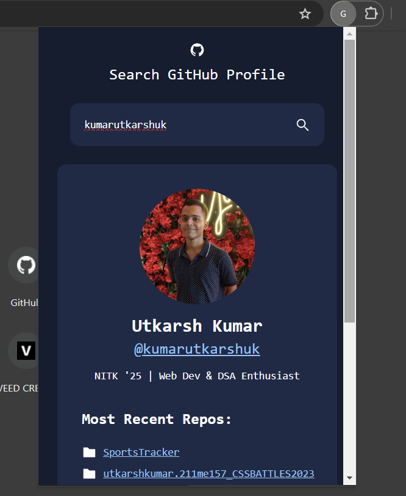
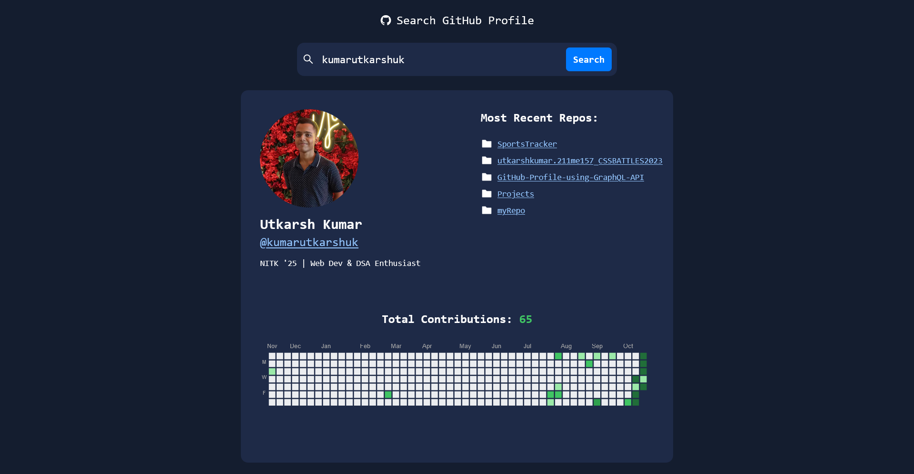

# Task ID: GitHub Profile using GraphQL API

* Link to the deployed React app: [GitQL](https://gitql.vercel.app/)

## Task Details

1. GitQL is a user-friendly platform where folks can type in their GitHub username and get details like their picture, name, bio, latest projects, total contributions, and a visual representation of their activity.
2. I have used GitHub's GraphQL API to gather this information.
3. The whole thing was built using React, a popular web development tool.
4. To make it look good and work well on different screens, I've used Tailwind for styling.

## Bonus Feature
**Made a Chrome extension**

## Demo Video
Link to the Demo Video: [GitQL Demo](https://www.youtube.com/watch?v=fKi3SmYoFTc)

## Screenshot

## Challenges Faced
1. Finding a functional Heatmap Library.
2. Understanding GraphQL.
3. Creating a Chrome extension.

## References:
1. [Heatmap](https://github.com/haripo/react-github-contribution-calendar)
2. [React icons](https://react-icons.github.io/react-icons/)
3. [CSS Loader](https://10015.io/tools/css-loader-generator)

